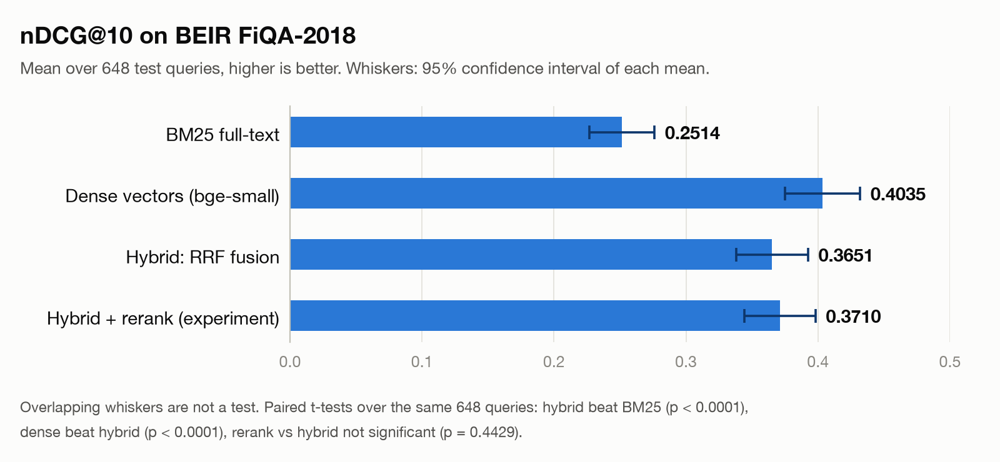
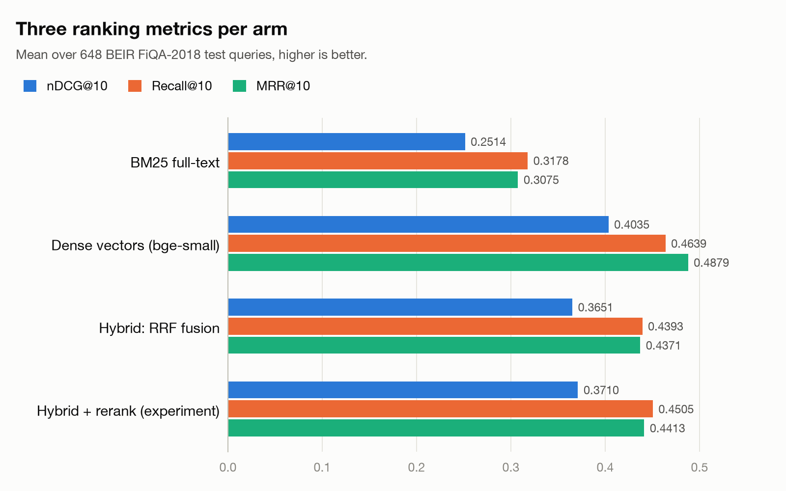

# Hybrid search, measured

**On BEIR FiQA-2018, dense vectors alone beat BM25 + dense rank fusion (nDCG@10 0.4035 vs 0.3651), and fusion beat BM25 alone (0.2514).**



**Clean-room rebuild on public data. Not my employer's code or data.**

## Read this first

- **Tested.** BM25 full-text search, dense vectors (bge-small-en-v1.5), their reciprocal rank fusion (RRF), and fusion plus a cross-encoder reranker, on 648 finance questions with paired significance tests.
- **Won.** Dense vectors alone, at nDCG@10 0.4035. Fusion (0.3651) beat BM25 (0.2514) significantly but lost to dense (p < 0.0001).
- **Reranker.** It added +0.0059 nDCG@10 over fusion (p = 0.4429, not significant) and cost 373.63 ms per query. It exists only in this rebuild.
- **What it means.** Fusion is not automatically better than its best arm. RRF gives each arm an equal vote, so a weak arm drags the fused list down. Measure each arm on your own corpus before fusing.
- **What it does not mean.** It does not show that hybrid search is a bad idea, and it describes no production system. One dataset, small models, no tuning.

## Problem

What a retrieval-augmented answer can say depends on what retrieval finds. Hybrid search is a common default for that step, and it is often adopted without being measured on the data it will serve. This repository asks two questions on public data. Does fusing full-text and vector search retrieve better than either one alone? And is the difference real, or noise?

## Hypothesis

Full-text search matches exact terms such as tickers, product names and codes, but misses paraphrase. Dense vectors capture meaning but can miss a rare exact term. Reciprocal rank fusion combines the two using rank positions only, so the arms' scores never need calibrating against each other.

```
score(d) = sum over arms of 1 / (k + rank of d in that arm)      k = 60, ranks start at 1
```

The common expectation is that fusion does at least as well as the better arm. This experiment tests that expectation instead of assuming it.

## Setup

| Part | Choice |
|---|---|
| Data | BEIR FiQA-2018, test split. 648 queries, 57,638 documents, 1,706 relevance judgements. The primary BEIR download host failed at the TLS handshake on 24/09/2026, so the loader fell back to the BEIR authors' Hugging Face mirror, pinned to a commit. File hashes are in `results/results.json`. |
| Full-text arm | `bm25s` 0.3.11, BM25 (Lucene variant), k1 = 1.5, b = 0.75 (library defaults), English stop words, Snowball stemmer. Top 100 per query. |
| Dense arm | `BAAI/bge-small-en-v1.5` (384 dimensions). Documents truncated at 512 tokens, queries given BGE's retrieval instruction, cosine similarity over L2-normalised vectors, exact search in numpy. Top 100 per query. |
| Fusion | RRF of the two top-100 lists with k = 60, the constant from Cormack, Clarke and Buettcher (2009), not tuned. Top 100 kept. |
| Rerank (experiment) | `cross-encoder/ms-marco-MiniLM-L6-v2` rescores the top 50 fused results. Ranks 51 to 100 keep their fused order, so Recall@100 cannot change. **Added in this public rebuild only. My production system has no reranker.** |
| Metrics | `ranx` 0.3.21. nDCG@10, Recall@5, Recall@10, Recall@100, MRR@10. |
| Significance | Two-sided paired t-test over the 648 queries (scipy), cross-checked against ranx's built-in test. The p-values matched in every row where both are defined. |
| Hardware | Apple M3, 8 GB RAM, PyTorch MPS backend, shared with other work during the run. |

## Results

Run on 24/09/2026. Every number below is copied from [`results/results.md`](results/results.md), which also lists every metric pair with its 95% confidence interval.

**Scores (mean over 648 queries)**

| Arm | nDCG@10 | Recall@5 | Recall@10 | Recall@100 | MRR@10 |
|---|---|---|---|---|---|
| BM25 full-text only | 0.2514 | 0.2454 | 0.3178 | 0.5593 | 0.3075 |
| Dense vectors only | **0.4035** | **0.3806** | **0.4639** | **0.6963** | **0.4879** |
| Hybrid: RRF (k=60) of BM25 + dense | 0.3651 | 0.3573 | 0.4393 | 0.6931 | 0.4371 |
| Experiment: hybrid + cross-encoder rerank (top 50) | 0.3710 | 0.3784 | 0.4505 | 0.6931 | 0.4413 |



Dense leads on all three top-of-list metrics. The reranker's small lifts over fusion are not significant (see below).

**Cost**

| Stage | Time |
|---|---|
| Encode 57,638 documents (bge-small, MPS) | 797.6 s |
| BM25 index | 2.7 s |
| Cross-encoder over 32,400 query-document pairs | 242.1 s |
| All stages | 1,048.0 s of compute; 1,176.1 s wall clock across 4 checkpointed invocations |

Per query: BM25 search 0.46 ms, dense (query encoding plus exact search) 4.36 ms, the fusion step 0.07 ms, cross-encoder rerank 373.63 ms.

## Significance

Each comparison is a paired test over the same 648 queries, so query difficulty cancels out. That is why the per-arm intervals in the chart above can overlap while the paired difference is still clear.

**nDCG@10, A minus B**

| Comparison (A vs B) | Difference | 95% CI | Change | p | A better / same / worse |
|---|---|---|---|---|---|
| hybrid vs BM25 | +0.1137 | +0.0984 to +0.1290 | +45.2% | <0.0001 | 310 / 292 / 46 |
| hybrid vs dense | -0.0383 | -0.0555 to -0.0212 | -9.5% | <0.0001 | 153 / 291 / 204 |
| hybrid + rerank vs hybrid | +0.0059 | -0.0092 to +0.0210 | +1.6% | 0.4429 | 177 / 301 / 170 |
| hybrid + rerank vs dense | -0.0324 | -0.0502 to -0.0147 | -8.0% | 0.0003 | 155 / 280 / 213 |
| dense vs BM25 | +0.1521 | +0.1284 to +0.1758 | +60.5% | <0.0001 | 317 / 246 / 85 |

**Other metrics, A minus B (p in brackets)**

| Comparison (A vs B) | Recall@10 | Recall@100 | MRR@10 |
|---|---|---|---|
| hybrid vs BM25 | +0.1215 (<0.0001) | +0.1338 (<0.0001) | +0.1296 (<0.0001) |
| hybrid vs dense | -0.0245 (0.0260) | -0.0032 (0.6812) | -0.0508 (<0.0001) |
| hybrid + rerank vs hybrid | +0.0111 (0.2577) | +0.0000 (identical) | +0.0042 (0.7126) |
| hybrid + rerank vs dense | -0.0134 (0.2185) | -0.0032 (0.6812) | -0.0466 (0.0002) |
| dense vs BM25 | +0.1461 (<0.0001) | +0.1370 (<0.0001) | +0.1804 (<0.0001) |

**Multiple tests.** The run makes 25 comparisons (5 pairs, 5 metrics). At a Bonferroni threshold of 0.05 / 25 = 0.002, 14 of the 25 stay significant, including every claim in the next section. Three differences fall between 0.002 and 0.05 (hybrid vs dense on Recall@5 and Recall@10, rerank vs hybrid on Recall@5). Read those as suggestive only.

## What the numbers mean

1. **Dense retrieval is the strongest single arm on this data.** It beat BM25 on every metric (nDCG@10 +0.1521, p < 0.0001), doing better on 317 queries and worse on 85.
2. **Fusion rescued BM25 but diluted dense.** Against BM25 the hybrid gained on every metric (nDCG@10 +0.1137, 95% CI +0.0984 to +0.1290). Against dense alone it lost at the top of the list (nDCG@10 -0.0383, MRR@10 -0.0508, both p < 0.0001), while the candidate pool held up (Recall@100 -0.0032, p = 0.6812).
3. **Why.** RRF gives each arm an equal vote, which suits two arms of similar quality. Here BM25 put more relevant documents in its top 10 than dense on only 50 of 648 queries, and fewer on 230. Most of BM25's votes pushed weaker documents up the fused list.
4. **The reranker did not earn its cost here.** It moved nDCG@10 by +0.0059 (p = 0.4429) and still finished below dense alone (-0.0324, p = 0.0003). Its one nominally significant gain, Recall@5 +0.0211 (p = 0.0469), does not survive the correction for multiple tests. It was trained on web search (MS MARCO) and applied to finance question answering. A domain mismatch is one possible reason, untested here.

The practical lesson is that hybrid search is not automatically better than its best component. Whether it helps depends on how strong each arm is on the corpus it serves, so it has to be measured there.

## Limits

- **One public dataset**, English finance question answering. Results may not carry over to other domains or to internal documentation.
- **Small models.** A 384-dimension embedding model and a 6-layer cross-encoder. Larger models may score differently.
- **No tuning.** BM25 parameters, RRF k and arm weights are all defaults. No weights were searched, deliberately, because tuning on the test split would flatter the result.
- **No chunking.** Documents were embedded whole and truncated at 512 tokens.
- **Exact vector search.** Approximate indexes can lose a little recall.
- **Statistics.** A paired t-test on bounded, skewed per-query scores. With 648 queries it is reasonably robust, but p-values near 0.05 should not carry weight.
- **Floating point.** MPS results can differ in the last digits across machines, so a rerun may reorder near-ties.
- **Data source.** The BEIR authors' Hugging Face mirror, because the primary host was unreachable on the run date. Counts are 648 queries, 57,638 documents and 1,706 judgements.

## How this maps to the production pattern

At work I run hybrid search of this shape. It combines pgvector similarity with Postgres full-text search, merges them by reciprocal rank fusion, and has no cross-encoder reranker. This rebuild keeps the shape and swaps in public, local stand-ins. `bm25s` stands in for Postgres full-text search, numpy cosine search over bge-small vectors stands in for pgvector, and the fusion step is the same RRF formula.

Two differences matter when comparing across. Postgres's built-in ranking functions (`ts_rank`, `ts_rank_cd`) do not weight terms by how rare they are across the corpus, as BM25 does, so the full-text arm here is a stand-in and not a replica. And this rebuild searches vectors exactly, where a production vector index may search approximately. None of the numbers above describe the production system. They describe the pattern on public data.

## Open question: should production add a reranker?

The production pattern stops at fusion, and the reranker here exists only in this rebuild. This experiment is the first evidence I have, and it argues against adding one without testing. On this data an off-the-shelf cross-encoder cost 373.63 ms per query on a laptop and gave no significant gain. Before adding one I would want answers to three questions.

- Does full-text search earn its vote on the real corpus? Internal documents full of codes and names may favour it more than FiQA does. The same harness, pointed at a labelled sample of real queries, would show it.
- Would fixing the fusion first (weighting the arms, or dropping a weak one) recover the gap for free? Any weights should be chosen on a development split and checked once on held-out queries.
- If a reranker still looks worth it, does a domain-matched one beat fusion on real queries by enough to justify the latency for interactive use?

## Reproduce

```bash
./run.sh --help              # options
./run.sh                     # creates .venv, installs pinned versions, runs tests, runs every arm, draws the charts
FRESH=1 ./run.sh             # also recompute the corpus vectors
VENV=/path/to/venv ./run.sh  # use an existing environment
./run.sh --no-rerank         # skip the reranker experiment
make test                    # unit tests only (add VENV=/path/to/venv if not using .venv)
make figures                 # redraw results/figures/ from the saved results, no retrieval
```

Needs Python 3.12 (`uv` is used if present). The environment takes about 1.3 GB, data and caches about 250 MB, and the two models about 225 MB of downloads. The slow stages (corpus encoding and reranking) checkpoint to `data/cache/` with the compute time of every chunk. `python -m hsm.run --max-seconds 440` runs in slices; exit code 3 means "run again to resume", and `run.sh` loops until done. Reported stage times are summed chunk times, so they do not depend on how many slices a run took.

To redraw the charts without the retrieval stack, `pip install matplotlib==3.11.2 scipy==1.18.1` is enough, then `python -m hsm.plot`.

## Repository map

| Path | What it holds |
|---|---|
| `hsm/data.py` | Downloads FiQA (primary BEIR zip, pinned mirror as fallback) and loads corpus, queries and test judgements |
| `hsm/retrievers.py` | BM25, dense encoding and search, cross-encoder rerank, with checkpointing |
| `hsm/fusion.py` | Reciprocal rank fusion |
| `hsm/evaluation.py` | ranx metrics, paired t-tests, confidence intervals |
| `hsm/run.py` | Runs every arm and writes `results/` |
| `hsm/plot.py` | Draws the two charts from the saved results; nothing is re-run |
| `tests/` | RRF on toy rankings (hand-computed and against ranx), metric sanity on toy judgements, chart inputs |
| `results/results.md` | Scores, all 25 paired tests with 95% confidence intervals, timings, versions |
| `results/results.json` | The same in machine-readable form, plus config, dataset source and file hashes |
| `results/per_query.csv` | Every query, arm and metric (648 queries by 4 arms) |
| `results/runs/*.trec.gz` | TREC run files, top 100 per query for each arm |
| `results/figures/` | `ndcg10.png` and `metrics.png`, drawn by `hsm/plot.py` |
| `run.sh`, `Makefile` | One-command reproduction; `make test`, `make figures`, `make run`, `make clean` |
| `requirements.txt`, `requirements.lock` | Direct dependencies pinned; the full resolved set |
| `data/` | Created at run time (downloads and caches), not committed |

## Data and model credits

- **BEIR** benchmark, Thakur et al. (2021). [Paper](https://arxiv.org/abs/2104.08663), [code](https://github.com/beir-cellar/beir). Data loaded from the authors' Hugging Face mirror, [BeIR/fiqa](https://huggingface.co/datasets/BeIR/fiqa) and [BeIR/fiqa-qrels](https://huggingface.co/datasets/BeIR/fiqa-qrels).
- **FiQA-2018**, the financial opinion mining and question answering challenge, Maia et al. (2018). [Challenge site](https://sites.google.com/view/fiqa).
- **bm25s**, Xing Han Lù. [github.com/xhluca/bm25s](https://github.com/xhluca/bm25s).
- **BAAI bge-small-en-v1.5**, Beijing Academy of Artificial Intelligence. [Model card](https://huggingface.co/BAAI/bge-small-en-v1.5), [paper](https://arxiv.org/abs/2309.07597).
- **cross-encoder/ms-marco-MiniLM-L6-v2**, from the Sentence Transformers project, trained on MS MARCO. [Model card](https://huggingface.co/cross-encoder/ms-marco-MiniLM-L6-v2).
- **ranx**, Elias Bassani. [github.com/AmenRa/ranx](https://github.com/AmenRa/ranx).
- **Reciprocal rank fusion**, Cormack, Clarke and Buettcher (2009). [DOI 10.1145/1571941.1572114](https://doi.org/10.1145/1571941.1572114).

No dataset or model weights are stored in this repository. They are downloaded at run time under their own licences.

## Licence

Code is MIT licensed. See [LICENSE](LICENSE).
